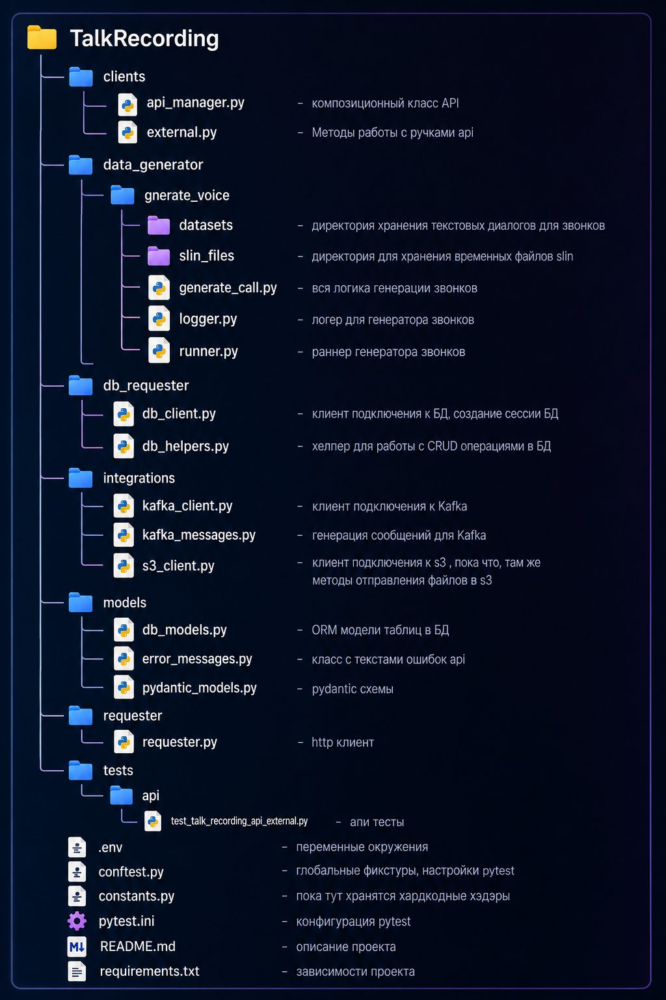

# Talk Recording
> Проект по автотестированию продукта Интеллектуальной записи, 
> содержит в себе тесты платформы и вспомогательные инструменты для тестирования.  
#### Установка зависимостей пректа
  ```bash 
  pip install -r requirements.txt
  ```
#### Структура проекта 



#### GenerateVoice
>Представляет собой скрипт, который имитирует процесс звонка:
> - генерация аудио из предоставленного текста(используется edge_tts, при необходимости будем искать что то побыстрей);
> - конвертация в формат .slin и 8000Hz;
> - загрузка файлов в s3;
> - отправление сообщения в кафку;  
##### Как пользоваться:
В пакете generate_voice лежат модули:
> - generate_call.py
> - logger.py
> - runner.py  

В runner.py в методе run_one меняем путь к файлу на нужный нам файл в переменной file_path и запускаем run_one метод.  

Структура текстового файла для генерации аудио:
1. txt файлы, в формате написания диалогов:  
```**txt
А: текст абонента А  
Б: текст абонента Б 
А: текст абонента А  
Б: текст абонента Б
---  
А: текст абонента А  
Б: текст абонента Б  
---  
```
Если диалогов несколько, разделитель "---" между диалогами обязателен, для формирования выборки. Выборка при нескольких диалогах ведется рандомно.   
2. Тип файлов json в фомате: 

    {
    "call_id": "personal_friend_01",
    "transcription": [
        {
            "owner": "caller",
            "message": "Привет, слушай, ты не занят завтра после обеда?",
            "timestamp": 1700002000000
        },
        {
            "owner": "callee",
            "message": "Привет! Нет, я как раз свободен с двух. А что случилось?",
            "timestamp": 1700002010000
        }....

При необходимости озвучить определенный диалог, необходимо чтоб в файле был один выбранный диалог из описанных форматов. 
При генерации аудио фромируется две аудиозаписи,абонента А и абонента Б. 
После отправления в s3 локальные аудиофайлы удаляются.

